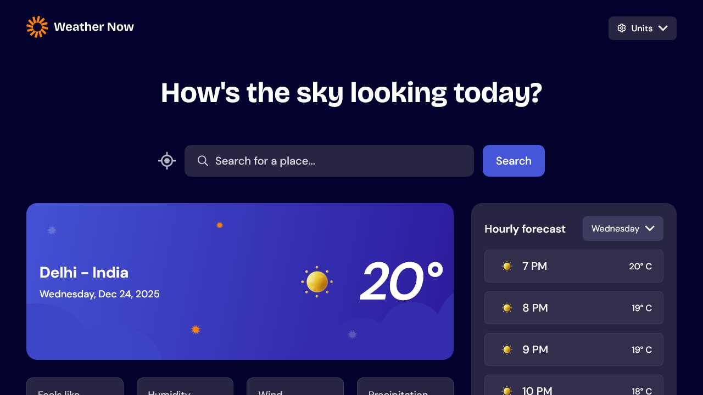
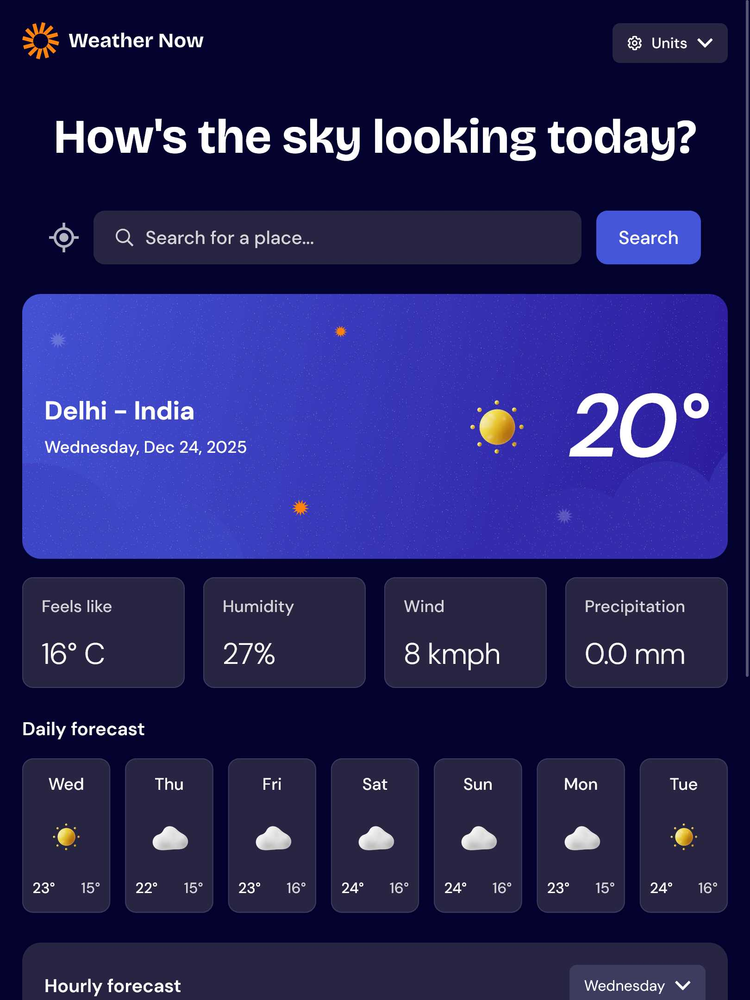
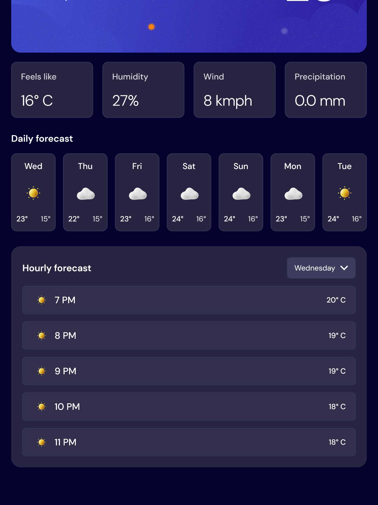
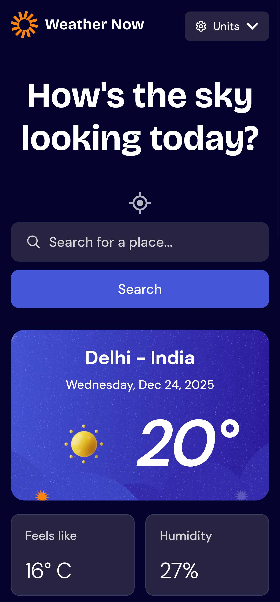
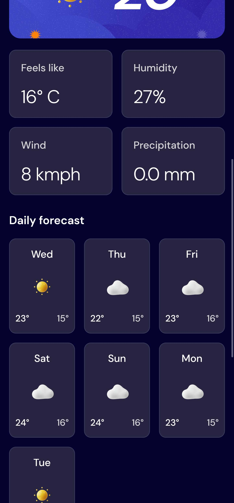

# Frontend Mentor - Weather app solution

This is a solution to the [Weather app challenge on Frontend Mentor](https://www.frontendmentor.io/challenges/weather-app-K1FhddVm49). Frontend Mentor challenges help you improve your coding skills by building realistic projects. 

## Table of contents

- [Overview](#overview)
  - [Screenshot](#screenshot)
  - [Links](#links)
- [My process](#my-process)
  - [Built with](#built-with)
  - [What I learned](#what-i-learned)
  - [Useful resources](#useful-resources)
- [Author](#author)
- [Acknowledgments](#acknowledgments)

## Overview

### Screenshot

  
  

  
  

### Links

- Solution URL: [Weather app Solution](https://github.com/kapil-2695/fmc-weather-app)
- Live Site URL: [Live site - Weather app](https://weather-app-176.netlify.app)

## My process
  
### Built with

- Semantic HTML5 markup
- CSS custom properties
- CSS `clamp()` function
- CSS media query
- React library (state, effect, ref, )

### What I learned

- I learned to to build a full working app with react library.
- I learned to apply the concepts learned in react to maintain state, fetch information from the api.
- I learned to make use of the external API for getting weather data, location infomation using reverse geocoding api, and to get the search reuslts.

### Useful resources

- [Learn CSS - web.dev](https://web.dev/learn/css/) - This helped me with CSS code.
- [Learn React - scrimba](https://scrimba.com/learn-react-c0e) - This is where I learned React.
- 

## Author

- Frontend Mentor - [@kapil-2695](https://www.frontendmentor.io/profile/kapil-2695)

## Acknowledgments

- I want to thank CSS expert Kevin Powell for creating informative content on his YouTube channel which helped me a lot in perfecting the designs.

- I want to thank scrimba for providing me with the great lessons because of which I could throughly understand React and the concepts behind it.

- I want to thank [Geoapify.com](https://www.geoapify.com/) for providing the free tier service to helped me a lot.